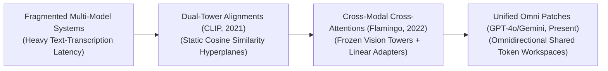
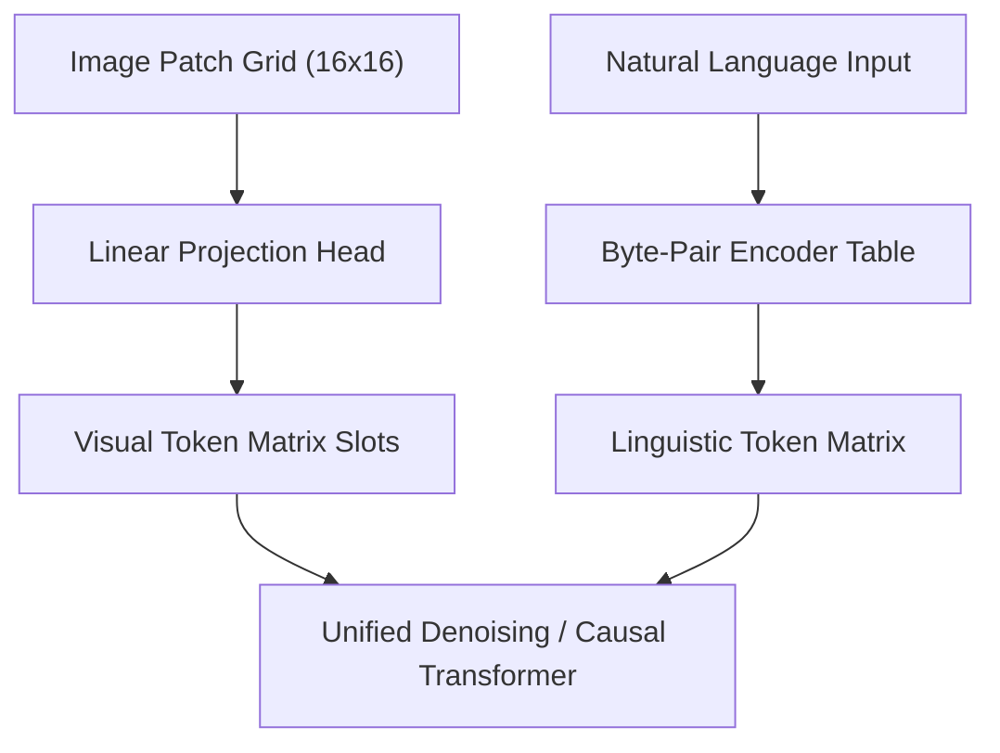

# 🚀 Awesome-Multimodal-Large-Language-Models
## 🧠 Multimodal Large Language Models (MLLMs): History, Progression, Variants, & Applications

**Multimodal Large Language Models (MLLMs)**—alternatively designated as Vision-Language Models (VLMs), Omni-Models, or Cross-Modal Foundation Decoders—represent an advanced paradigm in artificial intelligence that scales the auto-regressive context windows of foundational language architectures to ingest, comprehend, and synthesize diverse data modalities (such as text, images, video tokens, and audio waveforms) within a single unified workspace [INDEX: 1, 10]. 

Traditional language systems operate exclusively on text string parameters, leaving them fundamentally blind to spatial visual compositions or acoustic temporal frequencies. MLLMs resolve this limitation by encoding multi-sensory streams into a shared continuous latent hypersphere [INDEX: 10]. By mapping alternative signals directly to token matrices, the network unifies cross-modal perception and generative synthesis, creating a highly steerable tool for general computer vision, temporal physics understanding, and contextual omnidirectional actions [INDEX: 1, 4].

---

## 🕰️ 1. The Macro Chronological Evolution

The implementation of cross-sensory model scaling has transitioned from fragmented multi-model pipelines to dual-tower contrastive mappings, frozen convolutional alignment adapters, and modern native unified autoregressive token transformers.

| Era / Concept | Description | Year | Paper Link |
| --- | --- | --- | --- |
| [The Fragmented Multi-Model Pipeline Era](pages/fragmented-pipeline.md) | The early engineering standard where modalities were treated as isolated data islands. Chained models sequentially. | Pre-2021 | N/A |
| [The Dual-Tower Contrastive Alignment Era (CLIP)](pages/dual-tower-clip.md) | Sparked the modern multi-modal foundation boom by proving distinct modalities could share a single continuous vector space. | 2021 | [Radford et al., 2021](https://arxiv.org/abs/2103.00020) |
| [The Connected Cross-Attention Adapter Era](pages/cross-attention-flamingo.md) | Injected visual perception directly into generative text decoding parameter lines (Flamingo / LLaVA). | 2022 | [Alayrac et al., 2022](https://arxiv.org/abs/2204.14198) |
| [The Unified Omni Autoregressive Token Era](pages/unified-omni.md) | The current modern state-of-the-art foundation infrastructure standard seen in frontier systems. | 2023-Present | [OpenAI GPT-4o / Gemini](https://arxiv.org/abs/2312.11805) |

---

## 🏗️ 2. Core Functional & Architectural Variants

MLLM architectures are strictly categorized based on the exact routing topologies they use to integrate visual patch matrices alongside linguistic text tokens.

| Variant | Mechanism / Description | Year | Paper Link |
| --- | --- | --- | --- |
| [MLP-Adapter Architectures](pages/mlp-adapter.md) | Employs a simple, low-rank Multi-Layer Perceptron (MLP) or linear matrix to scale and project the terminal hidden states. | 2023 | [LLaVA Paper](https://arxiv.org/abs/2304.08485) |
| [Perceptual Cross-Attention Bottlenecks](pages/perceptual-bottlenecks.md) | Decouples raw pixel token dimensions from the language model's hidden layers using cross-attention bottlenecks. | 2021 | [Jaegle et al., 2021](https://arxiv.org/abs/2103.03206) |
| [Unified Native Transformers](pages/unified-native.md) | Completely merges data modalities at step zero. A single, unified multi-modal tokenizer. | 2024 | [Chameleon Team, 2024](https://arxiv.org/abs/2405.09818) |
| [Sparsely Routed Multi-Modal MoE](pages/sparse-moe.md) | Combines multi-modal sequence ingestion with Mixture-of-Experts (MoE) layers. | 2024 | [DeepSeek-V3, 2024](https://arxiv.org/abs/2412.19437) |

---

## ⚡ 3. The Multi-Modal Ingestion & Caching Matrix

To process high-resolution visual patch tokens alongside massive text contexts without triggering cluster stalls, modern MLLM serving nodes deploy hardware-fused caching layers [INDEX: 22].

**Omni Autoregressive Sequence Graph**

| Layer / Concept | Profile | Year | Paper Link |
| --- | --- | --- | --- |
| [Linear Patch Embedding Layers](pages/linear-patch.md) | Slashes convolutional scaling constraints by applying a 2D convolution flattening local spatial pixel regions. | 2020 | [Dosovitskiy et al., 2020](https://arxiv.org/abs/2010.11929) |
| [Multi-Head Latent Attention](pages/mla-cache.md) | Slashes inference VRAM overheads by compressing cache dimensions down into a low-rank latent vector. | 2024 | [DeepSeek-V2, 2024](https://arxiv.org/abs/2405.04434) |

---

## 🛡️ 4. Production Engineering Challenges & Hardening Mitigations

Deploying and scaling complex multi-modal foundation loops across commercial cloud infrastructure networks introduces severe attention memory bottlenecks and security vulnerabilities [INDEX: 22].

| Challenge | Problem & Mitigation | Year | Paper Link |
| --- | --- | --- | --- |
| [The Quadratic Token Inflation Wall](pages/quadratic-inflation.md) | Passing patches alongside long text prompts causes the self-attention matrix to hit a quadratic memory footprint wall. | 2017 | [Vaswani et al., 2017](https://arxiv.org/abs/1706.03762) |
| [Multi-Modal Indirect Prompt Injection](pages/indirect-prompt-injection.md) | Unified MLLMs process pixels and text tokens inside a shared attention space, creating vulnerabilities to hidden text commands. | 2023 | [Bagdasaryan et al., 2023](https://arxiv.org/abs/2307.10490) |

---

## 🌍 5. Frontier Real-World AI Infrastructure Applications

| Application | Details | Year | Paper Link |
| --- | --- | --- | --- |
| [Spatio-Temporal Video Generative Flow-Matching](pages/spatio-temporal-video.md) | Drives next-generation advanced cinematic pre-visualization and industrial simulation loops. | 2024 | [Sora / OpenAI, 2024](https://openai.com/sora) |
| [Autonomous Vehicle Bird's-Eye-View Actuation](pages/autonomous-bev.md) | Coordinates real-time perception and navigation for advanced self-driving automotive fleets. | 2022 | [BEVFormer, 2022](https://arxiv.org/abs/2203.17270) |
| [High-Resolution Clinical Diagnostic Tracking](pages/clinical-diagnostic.md) | Ingests massive multi-megapixel data matrices alongside conversational electronic health records. | 2023 | [Moor et al., 2023](https://arxiv.org/abs/2303.13375) |

---

## 📚 References
1. Vaswani, A., et al. (2017). Attention is all you need: Scalable foundational transformer matrix blocks. *Advances in Neural Information Processing Systems (NeurIPS)*, 30 [INDEX: 1].
2. Dosovitskiy, A., et al. (2020). An image is worth 16x16 words: Transformers for image recognition at scale via patchified linear embedding frontends. *arXiv preprint arXiv:2010.11929* [INDEX: 5].
3. Radford, A., et al. (2021). Learning transferable visual models from natural language supervision via contrastive dual-tower alignments. *International Conference on Machine Learning (ICML)* [INDEX: 10].
4. Jaegle, A., et al. (2021). Perceiver: General perception with iterative attention bottlenecks. *International Conference on Machine Learning (ICML)* [INDEX: 1, 10].
5. Kwon, W., et al. (2023). Efficient virtual memory management for long-context language model serving loops via pagedattention block routing. *vLLM Open-Source Infrastructure Framework Manual* [INDEX: 22].
6. DeepSeek-AI. (2025). DeepSeek-V3 Technical Report: Fused multi-head latent parallel attention and sharded multi-token prediction expert scaling protocols over distributed hardware clusters. *GitHub Repository Technical Infrastructure Manifesto* [INDEX: 18].

---

To advance this documentation repository, multimodal deployment blueprint, or MLOps architecture, consider exploring these adjacent development pathways:
* Build a **Python script using PyTorch and the Hugging Face `transformers` library** illustrating how to load a pre-trained vision-language model, slice a localized graphic into pixel patches, and run a cross-attention generation pass [INDEX: 5].
* Generate a **comprehensive Markdown table** explicitly comparing MLP-Adapter Models, Perceptual Bottleneck Architectures, Unified Native Transformers, and Multi-Modal Mixture-of-Experts (MoE) across mathematical activation loss functions, peak GPU VRAM caching footprints, token-length handling boundaries, and real-world inference latencies [INDEX: 1, 15, 22].
* Establish an **automated performance profiling suite using PyTorch Profiler** to track the exact computational token-per-second throughput, worker synchronization times, and memory bus bandwidth compression achieved when executing an omnidirectional pre-fill serving pass over distributed cluster nodes [INDEX: 22].

***

**Follow-Up Options Matrix:**

Before updating this documentation repository, let me know how you would like to proceed by choosing one of the options below:
* I can provide a **complete Python code boilerplate using PyTorch** demonstrating how to write an automated script that extracts patch embeddings from a raw 2D pixel tensor grid natively [INDEX: 5].
* I can generate a **Markdown matrix table** tracking the default context boundaries, image patch thresholds, and vocabulary dimensions utilized by leading foundation multi-modal open-weight repositories [INDEX: 5, 15].
* I can write a detailed technical explanation focusing on the **mathematics of Classifier-Free Guidance (CFG) scale modulation** and how it steers multi-modal probability density trajectories during spatial auto-regressive decoding [INDEX: 23].

