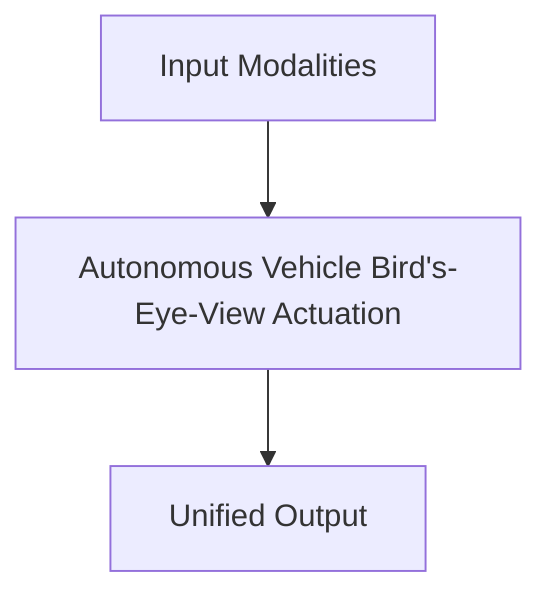

# Autonomous Vehicle Bird's-Eye-View Actuation

## Overview
Coordinates real-time perception and navigation for advanced self-driving automotive fleets.

**Year:** 2022
**First Paper:** [BEVFormer, 2022](https://arxiv.org/abs/2203.17270)

## Architecture Diagram

## Detailed Information
This page provides an in-depth look at Autonomous Vehicle Bird's-Eye-View Actuation. (Detailed content goes here).
[Back to README](../README.md)
