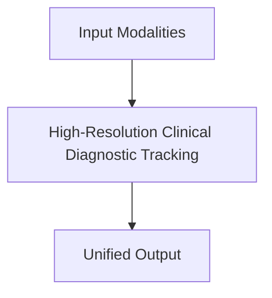

# High-Resolution Clinical Diagnostic Tracking

## Overview
Ingests massive multi-megapixel data matrices alongside conversational electronic health records.

**Year:** 2023
**First Paper:** [Moor et al., 2023](https://arxiv.org/abs/2303.13375)

## Architecture Diagram

## Detailed Information
This page provides an in-depth look at High-Resolution Clinical Diagnostic Tracking. (Detailed content goes here).
[Back to README](../README.md)
