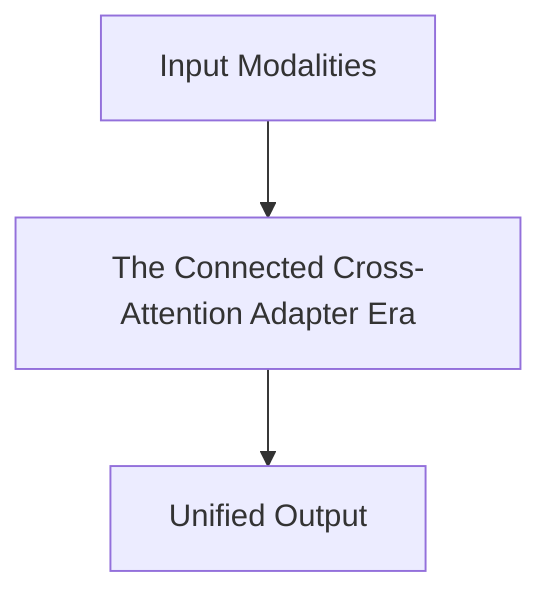

# The Connected Cross-Attention Adapter Era

## Overview
Injected visual perception directly into generative text decoding parameter lines (Flamingo / LLaVA).

**Year:** 2022
**First Paper:** [Alayrac et al., 2022](https://arxiv.org/abs/2204.14198)

## Architecture Diagram

## Detailed Information
This page provides an in-depth look at The Connected Cross-Attention Adapter Era. (Detailed content goes here).
[Back to README](../README.md)
