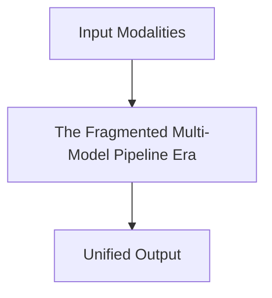

# The Fragmented Multi-Model Pipeline Era

## Overview
The early engineering standard where modalities were treated as isolated data islands. Chained models sequentially.

**Year:** Pre-2021
**First Paper:** N/A

## Architecture Diagram

## Detailed Information
This page provides an in-depth look at The Fragmented Multi-Model Pipeline Era. (Detailed content goes here).
[Back to README](../README.md)
