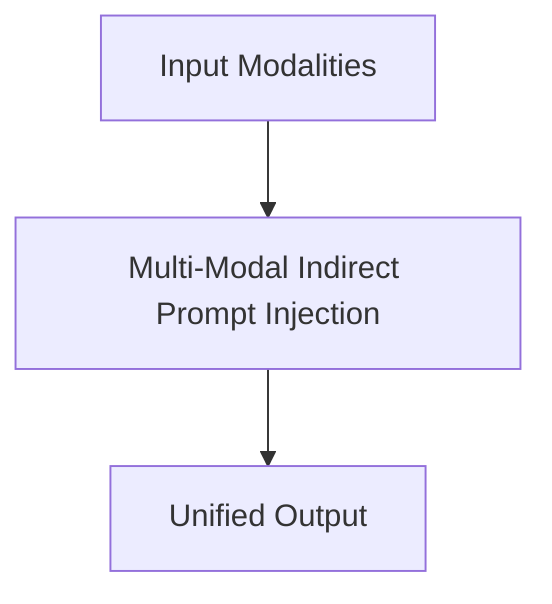

# Multi-Modal Indirect Prompt Injection

## Overview
Unified MLLMs process pixels and text tokens inside a shared attention space, creating vulnerabilities to hidden text commands.

**Year:** 2023
**First Paper:** [Bagdasaryan et al., 2023](https://arxiv.org/abs/2307.10490)

## Architecture Diagram

## Detailed Information
This page provides an in-depth look at Multi-Modal Indirect Prompt Injection. (Detailed content goes here).
[Back to README](../README.md)
