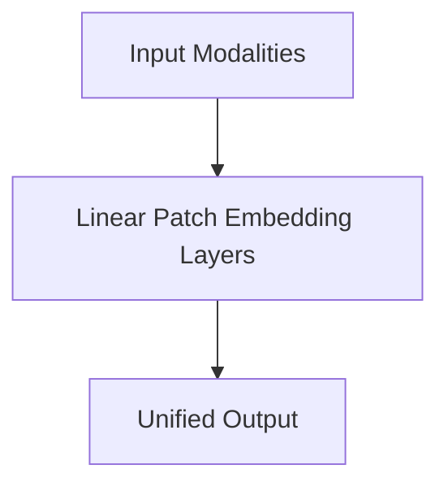

# Linear Patch Embedding Layers

## Overview
Slashes convolutional scaling constraints by applying a 2D convolution flattening local spatial pixel regions.

**Year:** 2020
**First Paper:** [Dosovitskiy et al., 2020](https://arxiv.org/abs/2010.11929)

## Architecture Diagram

## Detailed Information
This page provides an in-depth look at Linear Patch Embedding Layers. (Detailed content goes here).
[Back to README](../README.md)
