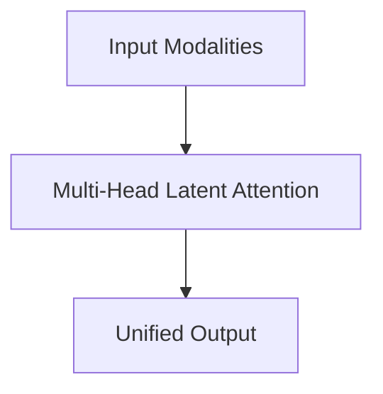

# Multi-Head Latent Attention

## Overview
Slashes inference VRAM overheads by compressing cache dimensions down into a low-rank latent vector.

**Year:** 2024
**First Paper:** [DeepSeek-V2, 2024](https://arxiv.org/abs/2405.04434)

## Architecture Diagram

## Detailed Information
This page provides an in-depth look at Multi-Head Latent Attention. (Detailed content goes here).
[Back to README](../README.md)
