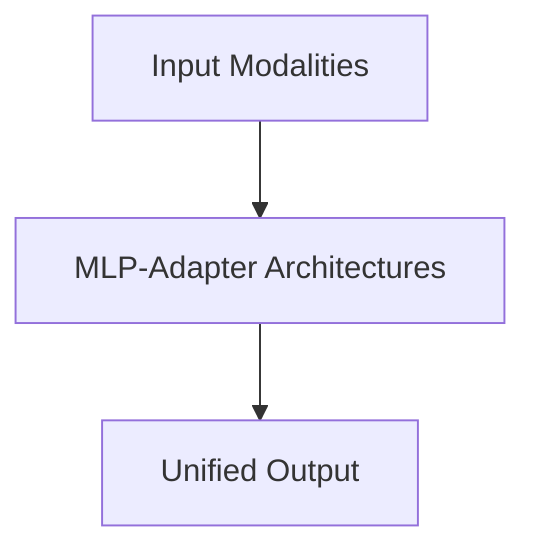

# MLP-Adapter Architectures

## Overview
Employs a simple, low-rank Multi-Layer Perceptron (MLP) or linear matrix to scale and project the terminal hidden states.

**Year:** 2023
**First Paper:** [LLaVA Paper](https://arxiv.org/abs/2304.08485)

## Architecture Diagram

## Detailed Information
This page provides an in-depth look at MLP-Adapter Architectures. (Detailed content goes here).
[Back to README](../README.md)
