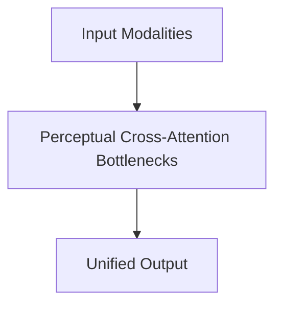

# Perceptual Cross-Attention Bottlenecks

## Overview
Decouples raw pixel token dimensions from the language model's hidden layers using cross-attention bottlenecks.

**Year:** 2021
**First Paper:** [Jaegle et al., 2021](https://arxiv.org/abs/2103.03206)

## Architecture Diagram

## Detailed Information
This page provides an in-depth look at Perceptual Cross-Attention Bottlenecks. (Detailed content goes here).
[Back to README](../README.md)
