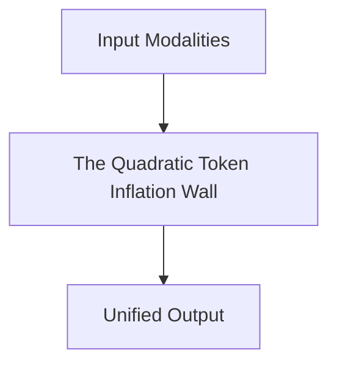

# The Quadratic Token Inflation Wall

## Overview
Passing patches alongside long text prompts causes the self-attention matrix to hit a quadratic memory footprint wall.

**Year:** 2017
**First Paper:** [Vaswani et al., 2017](https://arxiv.org/abs/1706.03762)

## Architecture Diagram

## Detailed Information
This page provides an in-depth look at The Quadratic Token Inflation Wall. (Detailed content goes here).
[Back to README](../README.md)
