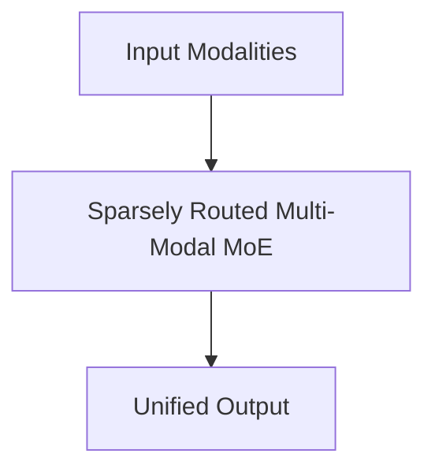

# Sparsely Routed Multi-Modal MoE

## Overview
Combines multi-modal sequence ingestion with Mixture-of-Experts (MoE) layers.

**Year:** 2024
**First Paper:** [DeepSeek-V3, 2024](https://arxiv.org/abs/2412.19437)

## Architecture Diagram

## Detailed Information
This page provides an in-depth look at Sparsely Routed Multi-Modal MoE. (Detailed content goes here).
[Back to README](../README.md)
