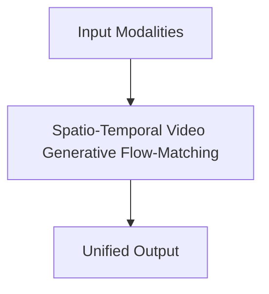

# Spatio-Temporal Video Generative Flow-Matching

## Overview
Drives next-generation advanced cinematic pre-visualization and industrial simulation loops.

**Year:** 2024
**First Paper:** [Sora / OpenAI, 2024](https://openai.com/sora)

## Architecture Diagram

## Detailed Information
This page provides an in-depth look at Spatio-Temporal Video Generative Flow-Matching. (Detailed content goes here).
[Back to README](../README.md)
