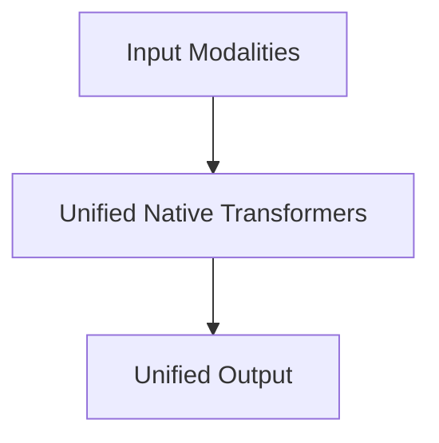

# Unified Native Transformers

## Overview
Completely merges data modalities at step zero. A single, unified multi-modal tokenizer.

**Year:** 2024
**First Paper:** [Chameleon Team, 2024](https://arxiv.org/abs/2405.09818)

## Architecture Diagram

## Detailed Information
This page provides an in-depth look at Unified Native Transformers. (Detailed content goes here).
[Back to README](../README.md)
