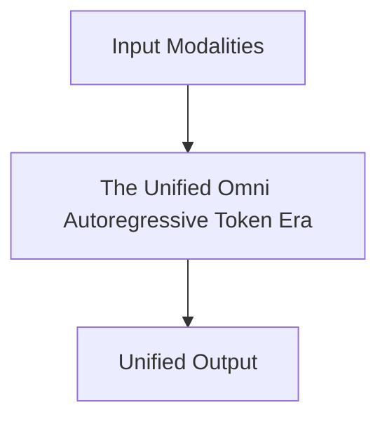

# The Unified Omni Autoregressive Token Era

## Overview
The current modern state-of-the-art foundation infrastructure standard seen in frontier systems.

**Year:** 2023-Present
**First Paper:** [OpenAI GPT-4o / Gemini](https://arxiv.org/abs/2312.11805)

## Architecture Diagram

## Detailed Information
This page provides an in-depth look at The Unified Omni Autoregressive Token Era. (Detailed content goes here).
[Back to README](../README.md)
